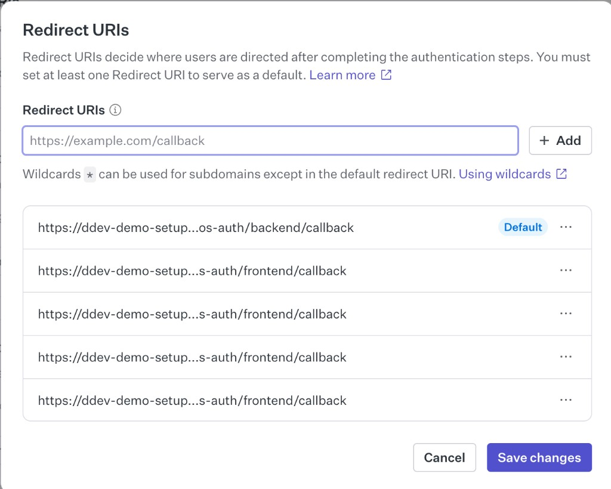
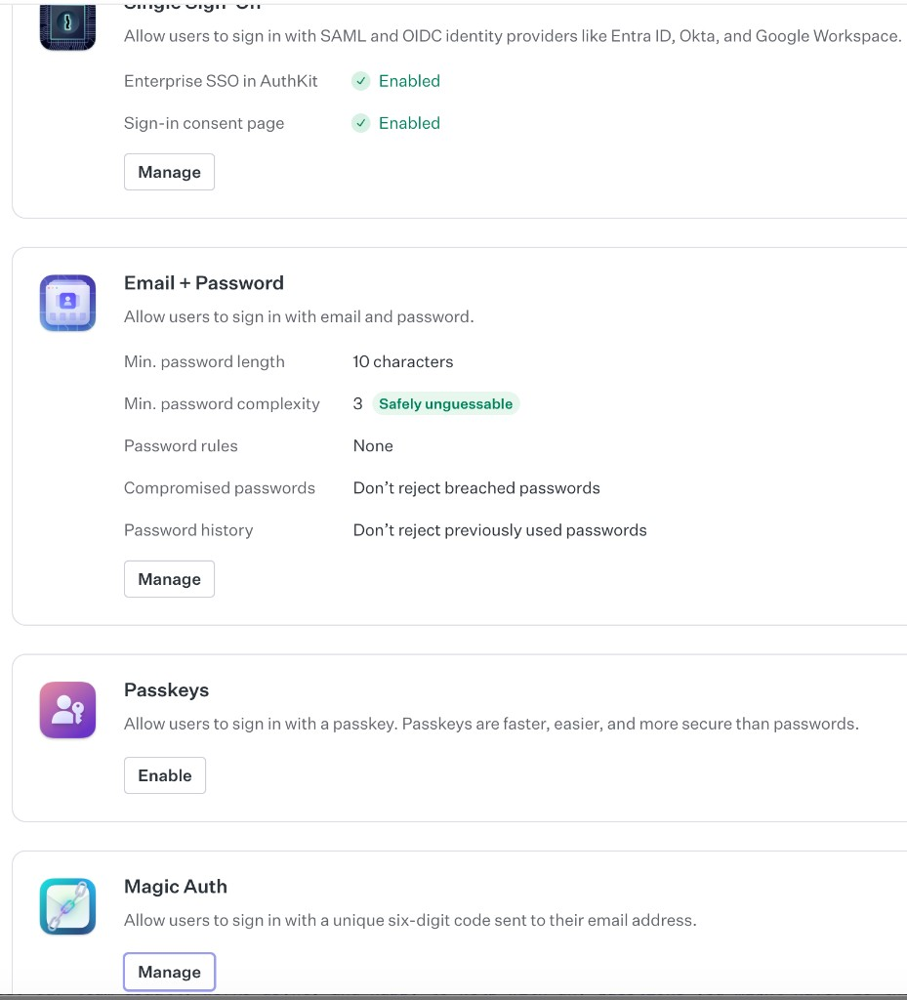
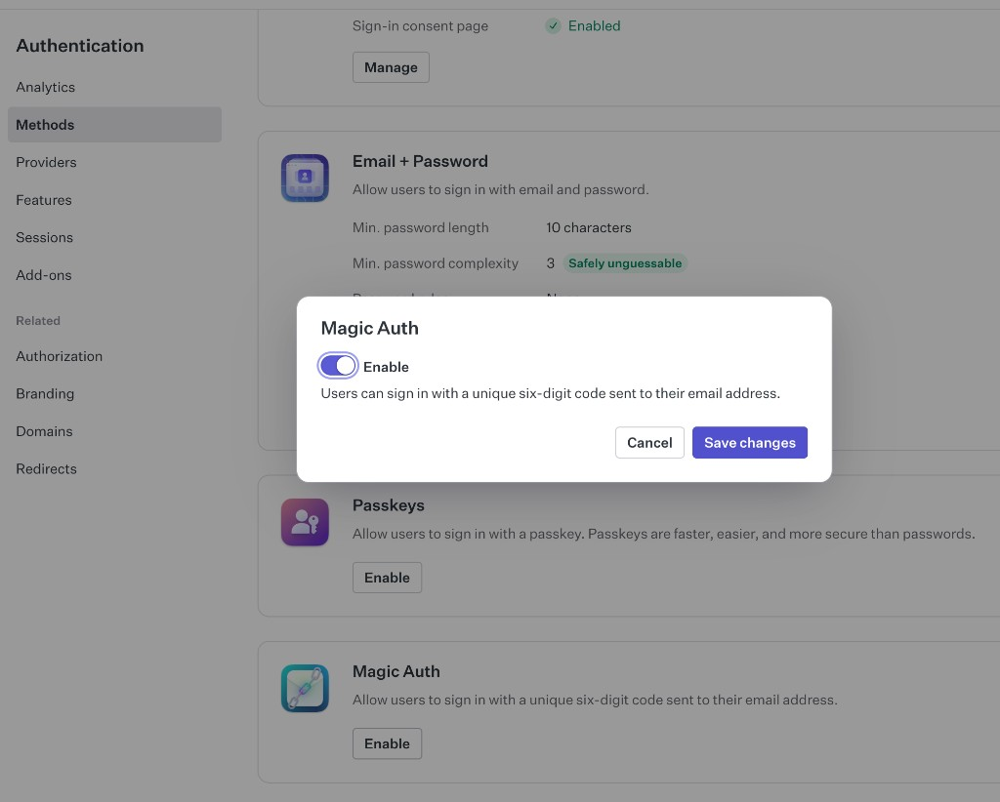

# WorkOS Dashboard setup

Every authentication method is **enabled in the WorkOS Dashboard** and
not in TYPO3. The extension only calls the WorkOS API, so a method that
is disabled in WorkOS cannot be used on your TYPO3 site — even if the
button appears on the login form.

Open the dashboard at <https://dashboard.workos.com>.

## 1. Add the Redirect URIs

Go to **Redirects** and add every callback URL listed in the TYPO3
setup assistant. Use the **+ Add** button once per URL and click
**Save changes** at the bottom.

Tip: the TYPO3 setup assistant has a **Copy all callback URLs** button
that copies every required URL to your clipboard.

## 2. Enable authentication methods

Go to **Authentication → Methods**.

Each method has an **Enable** or **Manage** button. Toggle the ones you
need and click **Save changes**.

### Magic Auth (email code)

Sends a six-digit code to the user's email address. Codes expire after
10 minutes.

1. Go to **Authentication → Methods**.
2. Find **Magic Auth** and click **Enable** (or **Manage** if already configured).
3. Toggle **Enable** on and click **Save changes**.

Once enabled, the "Email code" option on the TYPO3 login form works
immediately — no code changes needed.

### Email + Password

1. Go to **Authentication → Methods**.
2. Find **Email + Password** and click **Manage**.
3. Configure the password rules to match your security policy
   (minimum length, complexity, breach detection).

If you change the minimum password length here, also update the hint
text in the TYPO3 sign-up form template
(`Resources/Private/Language/locallang.xlf`,
key `frontend.signup.passwordHint`).

### Social providers

1. Go to **Authentication → Providers**.
2. Enable Google, Microsoft, GitHub and/or Apple.
3. Configure each provider with its OAuth client credentials (the
   WorkOS docs link to provider-specific guides).

The TYPO3 login form shows a button for each provider the extension
supports (`GoogleOAuth`, `MicrosoftOAuth`, `GitHubOAuth`, `AppleOAuth`).
Buttons that point to providers you haven't enabled will return a
"method not allowed" error from WorkOS — either enable them or hide
the unused buttons by overriding the `SocialButton` partial.

## Troubleshooting

See [`Troubleshooting.md`](Troubleshooting.md) for the common error
messages you might see after changes in the WorkOS Dashboard.
